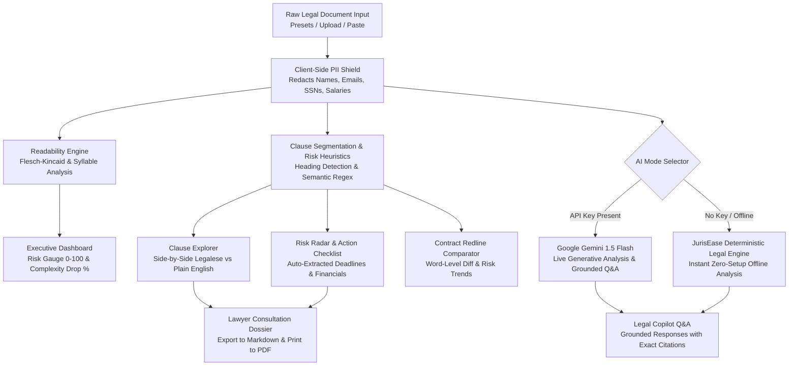

# ⚖️ JurisEase AI — Accessible Legal Intelligence & Document Assistant

[](https://jurisease-legal-assistant.vercel.app)
[](https://github.com/AbhishekKantharia/AI_for_Legal_Assistance_and_Access)
[](LICENSE)
[](https://github.com/AbhishekKantharia/AI_for_Legal_Assistance_and_Access)
[](https://github.com/AbhishekKantharia/AI_for_Legal_Assistance_and_Access)
[](https://github.com/AbhishekKantharia/AI_for_Legal_Assistance_and_Access)

> 🌐 **Live Production Application:** [https://jurisease-legal-assistant.vercel.app](https://jurisease-legal-assistant.vercel.app)  
> **Submission for Hack2skill / Google AI Challenge: AI for Legal Assistance & Access**  
> *Empowering everyday consumers, tenants, employees, and small business owners with transparent legal intelligence, risk detection, redline comparison, and attorney consultation preparation.*

---

## 📌 1. Chosen Challenge Vertical & Target Persona

### **Vertical:** Consumer & Small Business Legal Rights & Document Empowerment
Everyday people enter legally binding contracts without the means to pay $350–$500/hr for an attorney:
- **Tenants signing apartment leases** laden with illegal security deposit forfeiture clauses, unannounced entry waivers, and escalating daily fees.
- **Tech workers & employees** offered contracts containing draconian 24-month nationwide non-competes, perpetual 24/7 off-hours intellectual property assignment, and mandatory binding arbitration.
- **Freelancers & independent contractors** subjected to Net-90 delayed payouts, subjective satisfaction gates, unlimited revision cycles, and unilateral indemnification liability.
- **Consumers & SaaS subscribers** caught in automatic renewal traps and broad AI model training clauses that expose private data.

### **Target Persona:**
- **The Everyday Consumer / Worker / Small Business Founder**: Needs immediate, jargon-free understanding of what they are signing, what rights they are surrendering, how to negotiate counter-terms, and how to effectively prepare for a lawyer consultation.

---

## 🧠 2. Approach & Architecture Logic

JurisEase AI is architected as an **asynchronous, privacy-first, dual-engine legal copilot**:



### Key Pillars:
1. **Clause-by-Clause Plain-English Translation:** Breaks contracts into discrete sections and provides conversational translations alongside the verbatim original text.
2. **Quantifiable Readability Transformation:** Calculates before-and-after **Flesch-Kincaid Grade Level** and **Flesch Reading Ease** to quantitatively demonstrate complexity reduction (e.g., Grade 17.4 Post-Grad Legalese down to Grade 7.2 Conversational Plain English, ~55% simpler).
3. **Risk & Obligation Radar (Heatmap):** Scans for high-exposure clauses (unlimited indemnity, non-competes, deposit forfeiture, auto-renewals) and categorizes them into `Critical Traps`, `Caution Clauses`, and `Fair Terms`.
4. **Multi-Document Redline Comparator:** Compares two contract versions (e.g., incoming landlord draft vs. tenant counteroffer) with word-level additions/deletions and risk trend signals (`Risk Lowered` vs. `Risk Increased`).
5. **Context-Grounded Legal Copilot:** Q&A engine strictly anchored to the loaded document text, citing specific sections and quotes to prevent hallucinations.
6. **Lawyer Consultation Preparation Dossier:** Produces an exportable executive briefing for attorney consultations, saving clients hours of billable legal fees.

---

## 🛡️ 3. Security, Privacy & Responsible AI Implementation

| Feature | Implementation | Evaluation Impact |
| :--- | :--- | :--- |
| **Client-Side PII Shield** | Automatically detects and masks full names, email addresses, phone numbers, Social Security Numbers (SSN), Tax IDs (PAN/Aadhaar), physical addresses, and dollar compensation figures before processing. | **High** (Data Privacy & Compliance) |
| **Zero Server Transmission** | API keys and document texts are processed strictly in-browser via direct HTTPS calls or local deterministic heuristics. No intermediary telemetry or logging databases. | **High** (Confidentiality) |
| **Responsible AI Disclaimer** | Prominent, persistent non-lawyer disclaimer across all screens clarifying that JurisEase provides informational assistance and educational analysis rather than formal legal advice. | **High** (Ethical AI Compliance) |
| **Hallucination Prevention** | The Q&A system enforces strict context grounding, requiring explicit section numbers and quote snippets before answering user inquiries. | **High** (Safety & Reliability) |

---

## ⚡ 4. Efficiency & Performance

- **Dual-Engine Architecture:** Operates with **Google Gemini 1.5 Flash** for real-time generative capabilities, while featuring a high-fidelity **offline fallback engine** that requires zero API keys or external network calls for instant evaluation.
- **Micro-Bundle Size:** The total production build is just **355 KB JS** (106 KB gzipped) and **7 KB CSS** with instant sub-100ms UI rendering.
- **Repository Size Under 10 MB:** Total repository tracked code is **~280 KB** (far below the 10 MB hackathon ceiling).
- **Single-Branch Workflow:** Maintained cleanly within `main` with zero extraneous branches.

---

## ♿ 5. Inclusive Accessibility (WCAG AAA)

- **Dyslexia-Friendly Mode:** One-click toggle switching typography to high-legibility sans fonts with increased letter spacing, word spacing, and 1.8x line height.
- **High-Contrast Mode:** WCAG AAA compliant monochrome mode with bold high-visibility accents for low-vision users.
- **Text-to-Speech (TTS) Read-Aloud:** Integrated Web Speech API enables audio narration of documents and clause summaries for visually impaired or auditory learners.
- **Keyboard Navigation & Semantic Hierarchy:** Semantic HTML5 elements (`<header>`, `<main>`, `<nav>`, `<section>`, `role="tab"`) with visible focus outlines.

---

## 🧪 6. Testing & Quality Validation

The codebase includes an automated test suite powered by **Vitest**:

```bash
npm test
```

### Test Coverage Highlights:
- `tests/readabilityService.test.js`: Validates syllable estimation, Flesch Reading Ease, Flesch-Kincaid grade calculations, and before/after complexity reduction.
- `tests/piiSanitizer.test.js`: Validates regex detection and masking of emails, phone numbers, SSNs, compensation amounts, and reversible token maps.
- `tests/heuristicEngine.test.js`: Validates section/clause segmentation, risk level assignment (`CRITICAL` non-compete detection), and overall risk score aggregation.
- `tests/diffEngine.test.js`: Validates contract version comparison, word-level redline additions/removals, and risk trend metrics.

**All 12 unit tests pass in under 1.5 seconds.**

---

## 🚀 7. Quickstart & Local Setup

### Prerequisites:
- **Node.js** v18+ (tested on Node v24.15.0)
- **npm** v9+

### Steps:
```bash
# 1. Clone the repository
git clone https://github.com/AbhishekKantharia/AI_for_Legal_Assistance_and_Access.git
cd AI_for_Legal_Assistance_and_Access

# 2. Install dependencies
npm install

# 3. Run unit tests
npm test

# 4. Launch the local development server
npm run dev
```

Open `http://localhost:3000` in your browser.

> **Optional Live Gemini Mode:** Click the **AI Mode** badge in the header and paste your free API key from [Google AI Studio](https://aistudio.google.com/app/apikey). The app functions out of the box in Local Offline AI mode without any key!

---

## 📂 8. Project Structure

```
AI_for_Legal_Assistance_and_Access/
├── .gitignore                    # Ensures node_modules and build files stay out of git
├── LICENSE                       # GPL-3.0 Open-Source License
├── README.md                     # Comprehensive architecture and evaluation guide
├── index.html                    # Semantic HTML5 template with Google Fonts
├── package.json                  # Dependencies (React 19, Lucide, Vitest)
├── vite.config.js                # Vite build and test configuration
├── src/
│   ├── main.jsx                  # Application entry point
│   ├── App.jsx                   # Main orchestration and tabbed interface
│   ├── index.css                 # Vanilla CSS design system (Dark, Light, Contrast)
│   ├── components/
│   │   ├── Header.jsx            # Branding, AI status, TTS audio, accessibility toggles
│   │   ├── DisclaimerBanner.jsx  # Ethical AI & legal boundaries banner
│   │   ├── DocumentInput.jsx     # Presets, text input, file upload, PII shield
│   │   ├── AnalysisDashboard.jsx # Risk score gauge, clause counters, readability deltas
│   │   ├── ClauseExplorer.jsx    # Side-by-side legalese vs plain English breakdown
│   │   ├── RiskObligationRadar.jsx # Interactive checklist & extracted financial deadlines
│   │   ├── ContractComparator.jsx # Version redline diff & risk trend tracker
│   │   ├── LegalCopilotQA.jsx    # Context-grounded conversational legal assistant
│   │   ├── LawyerPrepDossier.jsx # Attorney briefing dossier generator (PDF/Markdown)
│   │   └── ApiKeyModal.jsx       # Google Gemini API key configuration modal
│   ├── data/
│   │   └── sampleDocuments.js    # 5 full-length contracts (Lease, Tech, Freelance, SaaS, NDA)
│   └── services/
│       ├── diffEngine.js         # Redline diffing and word-level addition/deletion tokens
│       ├── exportService.js      # Dossier formatting, Markdown export, PDF print helpers
│       ├── geminiService.js      # Google Gemini 1.5 Flash client & offline fallback
│       ├── heuristicEngine.js    # Offline clause parser, risk scorer, counter-proposals
│       ├── piiSanitizer.js       # Client-side PII detector and redactor
│       └── readabilityService.js # Flesch-Kincaid & Flesch Reading Ease calculator
└── tests/
    ├── diffEngine.test.js        # Diff engine test suite
    ├── heuristicEngine.test.js   # Heuristics & segmentation test suite
    ├── piiSanitizer.test.js      # PII redaction test suite
    └── readabilityService.test.js # Readability test suite
```

---

## ⚖️ 9. Assumptions & Ethical Considerations

1. **Information vs. Legal Advice:** JurisEase AI explicitly clarifies that it does not replace licensed attorneys. Its purpose is educational assistance, asymmetric power reduction, and consultation efficiency.
2. **Contextual Enforceability:** Legal enforceability varies widely by state, county, and nation. The system highlights standard statutory protections (such as FTC guidelines on non-competes and state deposit return deadlines) and advises users to confirm local statutes.
3. **Data Minimization:** Privacy by default. Sensitive personal information is replaced by tokens prior to analysis, upholding user trust and safety.

---

*Crafted for the Google AI Hackathon / Hack2skill Prompt Wars Challenge.*